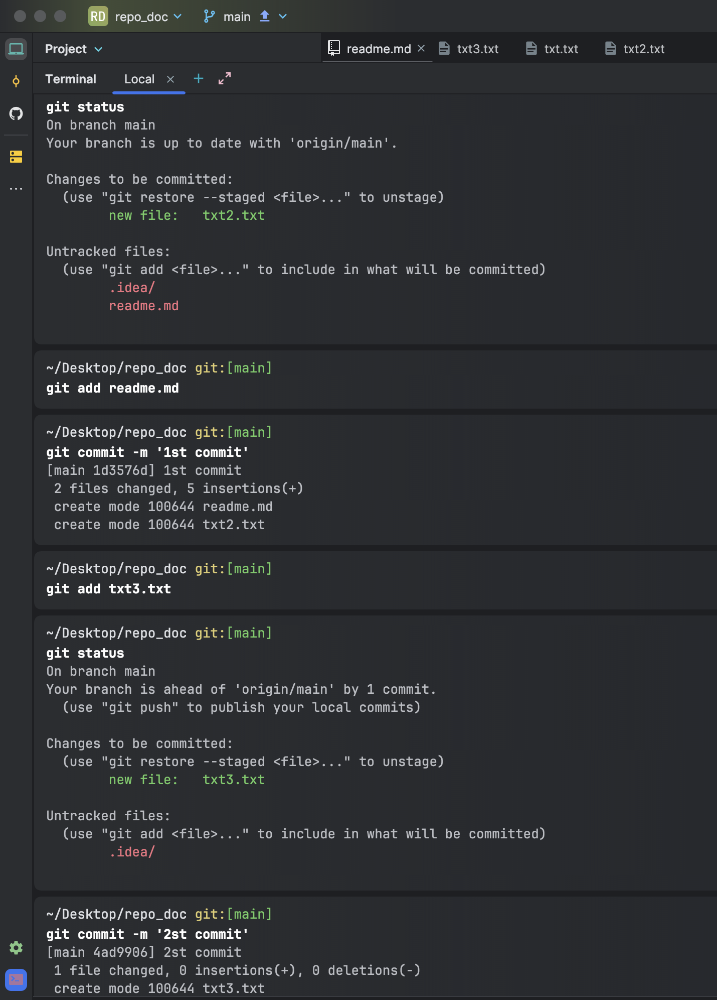
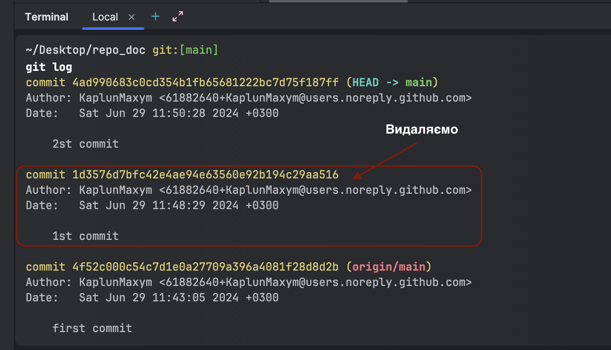
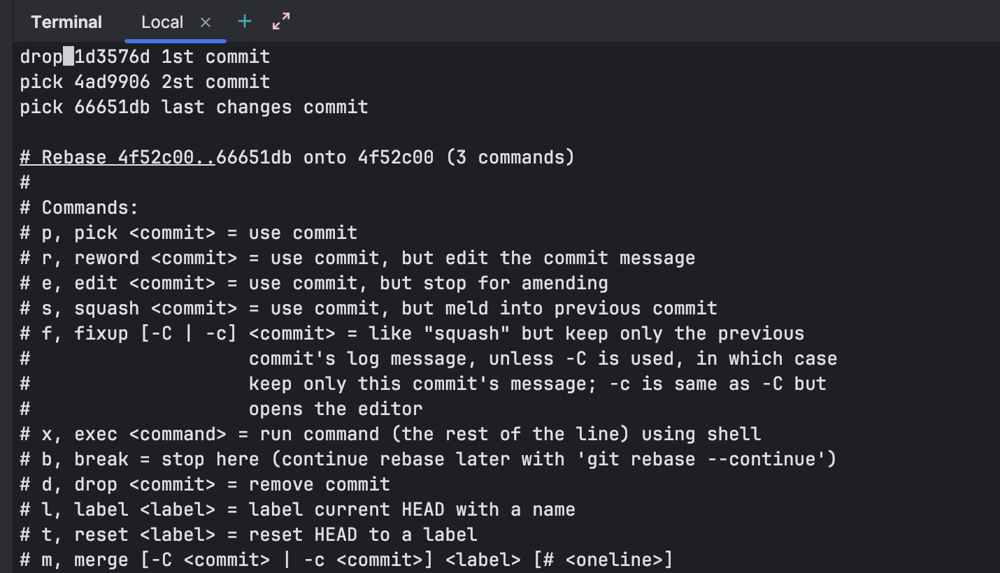
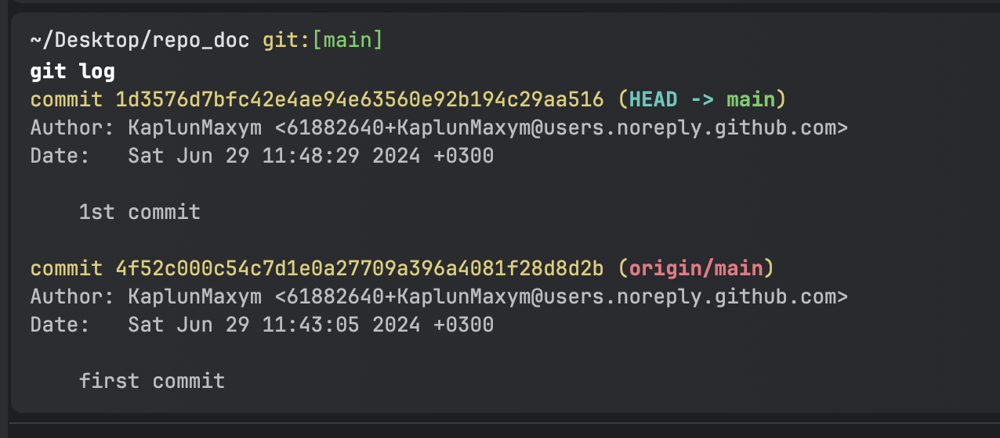

# Спосіб 1 Використання команди cherry-pick та тимчасової гілки і гилки по якій ми будемо працювати
#### Створіть тимчасову гілку з feature-branch:
```bash
git checkout -b temp-branch feature-branch
```


# Спосіб 2 Вибір одного коміту з багатьох
## тут без видалення інших комітів не обійтись
#### Робимо два коміта (тут важливо щоб вони файлами і версійностями не комфліктували один з одним)


## Важливо
#### Використовувати ці методи тільки на локальних гілках або на гілках, які ще не були відправлені на віддалений репозиторій, щоб уникнути проблем з синхронізацією з іншими учасниками.
#### Переглянути історію комітів, щоб знайти хеш коміту, який ви хочете видалити:
```bash
git log
```

#### Запускаємо команду інтерактивного rebase Де N - це кількість комітів від поточного коміту до коміту, який ви хочете видалити. Наприклад, якщо ви хочете редагувати останні 3 коміти, використовуйте HEAD~4.
```bash
git rebase -i HEAD~3
```
#### Відкриється текстовий редактор із списком комітів. Знайдіть коміт, який ви хочете видалити, і змініть команду перед ним з pick на drop:
#### Вийти з редактору vim: нажати esc + команда **:wq**

## Було видалино коміт

